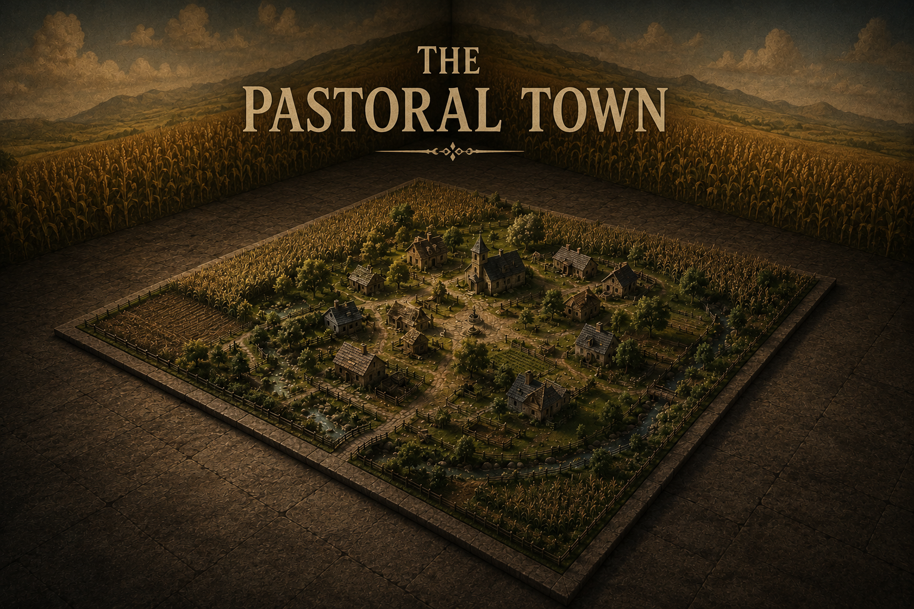
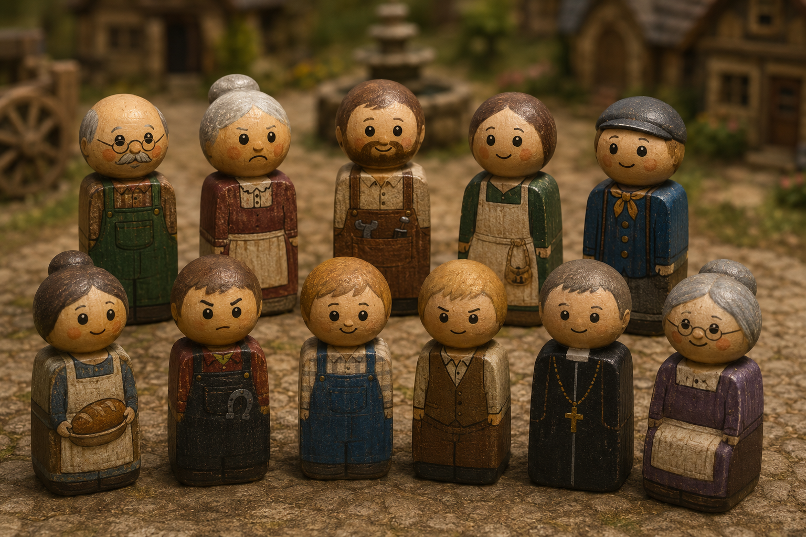
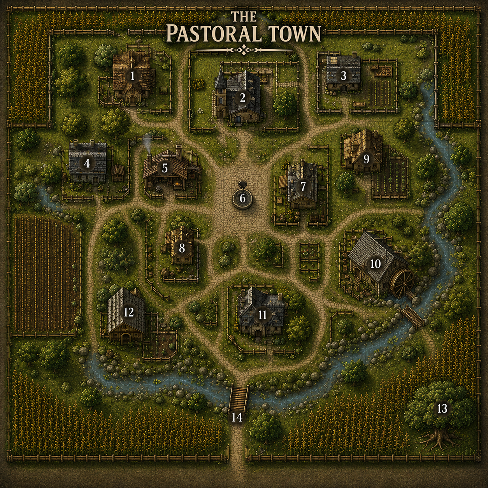

A pastoral town beset by the undead each night. Can the heroes keep its people alive until dawn?

---

# Forward 

This entry makes liberal use of AI from images to reworking my disjointed thoughts and reworking systems. Mostly every bit of text and design has been initially wrote by me and asked to be reworded so the average person can make sense of it. Take that as you will and I hope you enjoy the adventure. 

---

  
 Start Here

# Start Here

The Room is a 50x50 featureless cube except the walls are painted with life like mosaics of a cornfield, most who enter this room believe they are in an endless field unless they probe the walls. 

In the center the floor is a perfect 40x40 foot pastoral town, a miniature diorama. Tiny cottages, winding lanes, and a village square sit beneath walls painted with an endless illusion of golden cornfields stretching to every horizon.

The moment a creature touches the village or steps within it, they shrink to the scale of the diorama.

Life within seems perfectly ordinary. Supplies can be purchased, doors opened, and conversations held as expected. The only oddity is the villagers themselves: eleven peg-like people with square bodies, round heads, and painted faces. Though they resemble simple children's toys, they speak, laugh, worry, and emote as naturally as any person.

At dusk the eleventh hour, the illusion of tranquility shatters. From the painted cornfields march identical green peg zombies, silent toy invaders intent on killing every villager.

The challenge is simple: keep all ten villagers alive until dawn. The heroes have roughly 12 hours each day to prepare defenses, recruit help, lay traps, or devise their own solutions.

When the sun rises, the village resets. The dead live again, buildings are restored, and the day begins anew.

Only by ensuring that every villager survives the night does the hidden skull appear.

Leaving the diorama by any other means is impossible, and the villagers are their own worst enemies. 

---

  
The Brass Plaques 

# The Brass Plaques 

Two weathered brass plaques are fixed beside the miniature village.

## The Citizen's Rule

> Those who tread near become its people.
>
> The ones who dwell therin are both real and unreal, flesh and wood.
>
> Emotions will dictate not only the day but the night. 
> 
> When every soul survives the eleventh hour, the way shall reveal itself.

## The Caretaker's Rule

> One may remain beyond the town and bear the hand of the Caretaker.
>
> While the sun yet shines, the Caretaker may perform **one** of the following each day:
>
> * **Move** one object within the village.
> * **Place** one object into the village.
> * **Relocate** one willing creature to another place within the village.
> * **Repair** one damaged structure.
> * **Observe** any place in detail within the village.
> * **Read** The thoughts of any one villager. 
> * **Shape** the land, build or excavate
>
> At Night the Caretaker can:
> 
> * **Close** Slam shut and lock any **one** threshold, window door or shutter.
> * **Calm** Soothe any one distraught villager, this prevents them from further boughts of madness.
> * **Halt** Stop any one moving creature from acting for one turn. 
>
> At any time, the Caretaker may:
> 
> * **Strategize** At nightfall the caretaker is allowed to assist in calling out enemy movements or direct players. 
> * **Speak** a short message heard by all or an individual who stands below, any who say "Oh Caretaker" allow them to talk directly to their Lord" 
>
> The Caretaker may not directly harm those within, nor strike the green host that comes with night.
>
> **A gentle hand may guide, but never rule.**

---

### GM Advice

The Caretaker exists to give players outside the diorama meaningful choices without overshadowing those within. Each action should feel significant, so limit them to **one action  of each type per in game day**.

The Caretaker is encouraged to think creatively. If a proposed action is similar in scope to those listed, allow it. The intent is to let them reshape the battlefield in subtle ways not solve the encounter outright.

Some examples include:

* Moving a wagon to block a road.
* Dropping a rope, stick, pebble, or other small object into the village.
* Repairing a broken bridge or reinforcing a barricade.
* Relocating a willing hero to respond to an emergency.
* Looking down on any part of the village to scout enemy movements or locate a missing villager.
* Speaking a brief warning, encouragement, or instruction that echoes through the town like the voice of a distant god.

The Caretaker **cannot** attack enemies, crush invaders, remove monsters from the board, or otherwise bypass the central challenge. Their role is to support, inform, and enable the heroes inside the village, not to win the battle for them.

---

  
The Villagers

# The Villagers

## Village Roster

| NPC | Role | Relationships | Current Concern |
|------|------|---------------|-----------------|
| **Old Tom** | Elderly Farmer | Constantly argues with **Old Martha** | Wants to retrieve his scarecrow from the fields, doesn't think his wife is right. |
| **Old Martha** | Elderly Widow | Contradicts everything **Old Tom** says | Refuses to leave without Tom admitting she is right, and to leave the scarecrow. |
| **Ben** | Carpenter | Husband of **Anna**, father of **Will** | Repairing the jammed mill wheel. for the harvest festival, requires assistance to lift heavy stones. |
| **Anna** | Apocathary | Wife of **Ben**, mother of **Will** | Searching for her missing son. Worried and will wander farther, she will not sell potions or make tinctures untl he is found. |
| **Eli** | Miller | Friend of Jack and Peter | Clearing an overturned wagon from the bridge, contains the cornmeal shipment for the festival, may require the assistance of both **Jack** and **Peter** |
| **Rose** | Baker | Admired by **Jack** and **Peter** | Preparing for tomorrow's Harvest Feast and won't budge until cornbread is made. Unaware that she is in a love triangle and has a lover already, **Eli**. |
| **Jack** | Blacksmith | Rival of **Peter**, in love with **Rose** | Determined to duel Peter at noon to the death. |
| **Peter** | Wagoner | Rival of **Jack**, in love with **Rose** | Won't back down from the duel to the death. |
| **Father Paul** | Priest | Spiritual guide to the village | Preparing the chapel for the coming evil. Knows the caretaker can be spoken to and does so diligently. Can assist the party as the town respects him. |
| **Will** | Curious Boy | Son of **Ben** and **Anna** | Wandering near the great oak outside town. Looking for a birds nest. |
| **Granny May** | Infirm Villager | Cared for by the village | Bedridden in the infirmary and unable to flee, in constant pain. |

---

# The Eleven Villagers

Each morning the villagers awaken believing it to be an ordinary day. They remember nothing of previous nights and continue their routines unless convinced otherwise. Every villager has a pressing concern that, if left unresolved, will place them in grave danger when the green host marches from the cornfields at dusk.

---

## Old Tom

Lives in a cottage on the western edge of town.

A stubborn old farmer who refuses to admit Martha is ever right. Though age has slowed him, his pride has not.

**Current Situation:** Something large has been trampling the western cornfield and repeatedly knocking over Tom's beloved scarecrow. Convinced it's nothing more than a troublesome beast, he insists on marching into the fields to set it upright before sunset.

**Actionable:** Investigate whatever is flattening the corn, retrieve the scarecrow, convince Tom to leave it, or settle the argument between him and Martha.

---

## Old Martha

Tom's sharp-tongued wife.

She contradicts nearly everything Tom says—not because she dislikes him, but because she's usually right.

**Current Situation:** Martha is certain whatever lurks in the corn is dangerous. She refuses to leave until Tom admits she's right and agrees to abandon the scarecrow.

**Actionable:** Mediate the argument, convince Tom to relent, or remove the scarecrow so neither has reason to return to the fields.

---

## Ben

The village carpenter, husband of Anna, and father of Will.

Dependable and practical, Ben always puts the village before himself.

**Current Situation:** The mill wheel has jammed before tomorrow's Harvest Festival. Ben cannot move the heavy millstones alone and needs assistance before repairs can begin.

**Actionable:** Help Ben repair the mill or recruit others to assist him. Once finished, he'll gladly help fortify the village and listen to Father Paul. 

---

## Anna

The village apothecary.

A skilled herbalist whose remedies keep the town healthy.

**Current Situation:** Will has wandered off again. Anna refuses to sell potions or prepare medicines until her son is safely home.

**Actionable:** Find Will and return him to his mother. Once reunited, Anna freely prepares healing tinctures and poultices.

---

## Eli

The village miller.

Strong, patient, and one of Jack and Peters closest friends.

**Current Situation:** A wagon carrying the Harvest Festival's cornmeal has overturned on the bridge and broken its axle. Eli can't right it alone or repair it. He is madly in love with Rose but keeps it secret from Jack and Peter. He is unaware of the duel to the death. 

**Actionable:** Recruit Jack and Peter to help repair the wagon or find another solution. Once cleared, the cornmeal reaches Rose's bakery.

---

## Rose

The village baker.

Warm hearted and blissfully unaware that two men intend to kill one another over her. Her own sweetheart, Eli and she faithfully reads his letters.

**Current Situation:** Rose refuses to leave the bakery until enough cornbread has been baked for tomorrow's Harvest Festival but she cannot begin until Eli's cornmeal arrives after being ground at the mill.

**Actionable:** Deliver the cornmeal, help finish the baking, or convince her the festival can wait.

---

## Jack

The village blacksmith.

Hot headed, proud, and convinced Rose will love whichever man proves himself the stronger.

**Current Situation:** Jack has challenged Peter to a duel to the death at noon and refuses to back down.

**Actionable:** Prevent the duel, redirect his efforts toward helping Eli or Ben, or convince him Rose never wanted this.

---

## Peter

The village wagoner.

Hardworking and dependable, but every bit as stubborn as Jack.

**Current Situation:** Peter has accepted Jack's challenge, believing refusing it would cost him Rose forever.

**Actionable:** Convince him to abandon the duel, recruit him to help clear the wagon, or reveal Rose has no interest in either suitor.

---

## Father Paul

Caretaker of the village chapel.

The only villager who senses something is terribly wrong. Every morning he dreams of the green host, and every morning the village dismisses him.

**Current Situation:** Father Paul spends the day praying and speaking to the unseen Caretaker above the village. The townsfolk trust his judgment and are far more likely to heed his requests than those of strangers.

**Actionable:** Ask Father Paul to rally villagers, calm disputes, organize defenses, or spread warnings throughout the town.

---

## Will

Ben and Anna's adventurous young son.

Curious to a fault and forever wandering where he shouldn't.

**Current Situation:** Will has wandered to the great oak at the edge of the western cornfield searching for a bird's nest, oblivious to the dangers at nightfall, no one knows where he is but some have an idea:
- The Old Scarecrow - Old Martha
- Top of the Mill - Eli
- Under the Bridge - Rose
- The old Oak outside of town - Jack or Peter, won't even remember until after the duel is settled. 

**Actionable:** Find him and return him safely to Anna before darkness falls.

---

## Granny May

The oldest villager, bedridden in the infirmary.

Her painted wooden body is cracked with age, and every movement brings obvious pain.

**Current Situation:** Granny May cannot flee. She requires constant care and will be among the first villagers overwhelmed if left unattended.

**Actionable:** Assign someone to protect her, reinforce the infirmary, or carry her somewhere safer despite her protests, medicine from Anna May assist her, moving her without it could result in death. 

---

  
The Town

---

  

  
Keeping Time

# Keeping Time

The village is small enough that distance is rarely an obstacle. Time, however, is.

You may opt to keep a visible clock, beginning at **06:00**. Advance it whenever the players spend meaningful time.

## Common Activities

| Activity | Time |
|----------|------:|
| Travel to another numbered location | 10 minutes |
| Cross the southern bridge | Included in movement |
| Brief conversation | 10 minutes |
| Lengthy discussion or interrogation | 20–30 minutes |
| Search a room | 10 minutes |
| Search an entire building | 20–30 minutes |
| Examine an unusual object | 10 minutes |
| Repair, build, or organize | 30–60 minutes |
| Rest or wait | As long as desired |

Use these as guidelines rather than strict rules. If something would reasonably take longer, let it.

---

## Daylight

The adventure begins at **06:00** on a late November(ish) morning.

Dusk falls at **18:00**. This gives the players **12 hours**

As the hours pass, the village changes naturally.

- Villagers leave for errands.
- Meals are prepared.
- Shops close.
- Smoke rises from chimneys.
- The streets grow quieter.
- Long shadows creep across the square.

The village is alive and bustling. 

---

## Wasting Time

The players are free to spend their time however they wish.

They may question every villager, search every home, or argue over their next move. Every decision carries a cost.

Whenever the players linger, simply advance the clock.

A discussion that drags on for twenty minutes should cost twenty minutes.

Searching several houses may consume hours.

If the players choose to wait, advance the clock by however much time they spend.

The pressure comes not from the distance between locations, but from the knowledge that daylight is finite.

---

## GM Guidance

Do not interrupt the players simply because time has passed. Instead, remind them that the day is moving on and advance the clock if it is visible. 

Rather than saying:

> "Another ten minutes pass."

Describe the world around them.

> *The church bell tolls the hour.*

> *The smell of fresh bread drifts from nearby homes.*

> *Children disappear indoors as the afternoon cools.*

> *The sun hangs lower above the western fields.*

These small reminders reinforce that every conversation, search, and delay brings the village closer to night.

---

