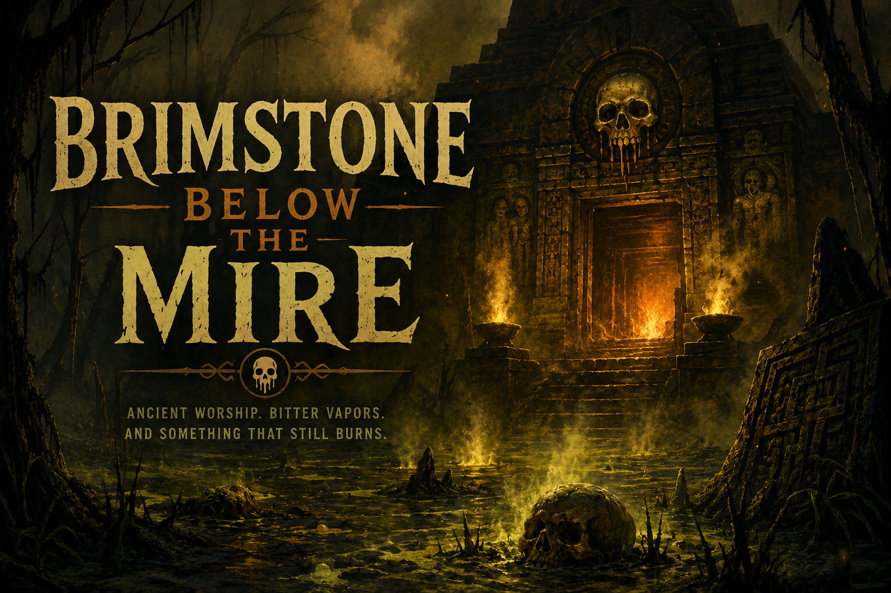
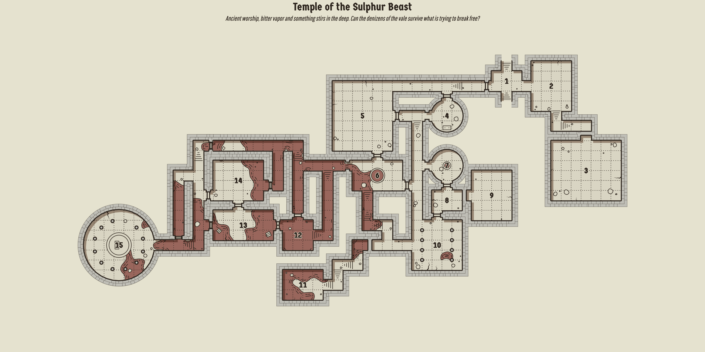

## The Situation Thus Far

During the height of Eledain's empire, a splinter sect abandoned the worship of dragons, believing only fire itself was worthy of reverence. They vanished into the great swamps, where they raised a temple above deep volcanic fissures, tending eternal flames fed by sulphur and brimstone.

In their endless search for the source of the sacred fire, they dug too deep.

From the abyss below emerged an ancient leviathan a colossal, kraken like horror with skin like black obsidian and a maw that breathed sulphur and ash. Mistaking the beast for the living heart of fire, the cult bent the knee. They fed it sacrifices, built shrines in its name, and became utterly devoted.

They never realized they were not its chosen.

They were livestock.

Eledain's court mages uncovered the truth through a scrying ritual: the creature was preparing to flood the surface with its ravenous brood. Unable to destroy it, Eledain struck a desperate bargain with the ancient giants. One of their colossal war machines was sent to the temple, where it held the gates shut while the complex was sealed. The titan fell at its post, entombing the cult, their false god, and whatever still waited beneath the mire.

## Rumours of Brimstone Below the Mire

Ask around any hearth, ferry, or lonely homestead near the southern marshes and you'll hear whispers of the old temple. Roll **1D6** or choose a rumour.

| d6 | Rumour | Truth? |
|:--:|---------|:------:|
| 1 | **The swamp has begun bubbling again.** Hunters swear the water hisses at night, and yellow smoke rolls across the reeds. | **True** |
| 2 | **An iron giant still guards the temple.** It hasn't moved in centuries, but folk say anyone who tries to force the doors open will wake it. | **True** (The titan still stands, though whether it can awaken is another matter.) |
| 3 | **The temple was sealed for a reason.** Old stories claim Eledain himself ordered it closed after his mages discovered something beneath the swamp that should never see daylight again. | **True** |
| 4 | **The temple vault holds Eledain's lost relics** Plenty have gone looking for it. None have returned with proof. | **False** |
| 5 | **The bubbling pools are cursed.** Anyone who breathes the yellow vapours slowly turns to stone before sinking beneath the muck. | **False** |
| 6 | **The titan's mace is forged from pure gold.** Dragging it out would make anyone richer than a king—if they could lift it. | **False** |

## Travelling near the Sulphured Swamp
> Roll on these tables when travelling around or in hex 21. 

## Weather (1d8)

The swamp is alive. Warm mud bubbles beneath every footstep, sulphur hangs thick in the air, and ancient fires still burn beneath the mire. Weather here is downright volcanic.

| d8 | Weather | Effect |
|:--:|----------|--------|
| 1 | **Still Mire** | Oppressive humidity. No mechanical effect, but every sound carries. Random encounters are made with **Boon/Bane** in the creatures' favour. |
| 2 | **Sulphur Fog** | Yellow mist blankets the swamp. Visibility is reduced to **Short** range. Scouts suffer **Bane** when keeping watch or navigating. |
| 3 | **Ash Drift** | Fine grey ash falls like snow. Tracks disappear after an hour. Navigation rolls suffer **Bane**. Fires require twice as much fuel. |
| 4 | **Steam Vents** | Hidden fumaroles burst from beneath the water. Anyone travelling off established paths must make an **Evade** roll or take minor fire damage and become **Exhausted**. |
| 5 | **Brimstone Rain** | Warm acidic drizzle falls from above. Armour and weapons must be cleaned during camp or temporarily lose 1 point of durability until maintained. Open flames sputter constantly. |
| 6 | **Burning Gas** | Blue flames dance across the bog where methane ignites. Movement is halved through affected areas. Any open flame risks triggering brief explosions. |
| 7 | **Cinder Wind** | Hot winds carry burning ash. Ranged attacks beyond **Near** range suffer **Bane**. Everyone gains a level of fatigue unless they cover their face. |
| 8 | **The Earth Breathes** | The ground rumbles as clouds of sulphur erupt from below. The Guide immediately makes a Navigation roll. On a failure, the party becomes lost as familiar paths disappear beneath boiling mud and steam. |

---

## Journey Mishaps (1d12)

Use these in place of, or alongside, the standard Dragonbane journey mishaps while travelling through the sulphur swamp.

| d12 | Mishap |
|:---:|--------|
| 1 | **The Bog Ignites.** A sheet of blue fire races across stagnant water. Find cover or suffer fire damage. |
| 2 | **Poison Vapours.** A low cloud of sulphur gas settles over the trail. Make a **CON** roll or become **Exhausted** until your next rest. |
| 3 | **Boiling Sinkhole.** The earth gives way beneath someone's feet into scalding mud. Rescue them before they disappear beneath the mire. |
| 4 | **The Path Dissolves.** Solid ground suddenly collapses into black muck. Lose half a day's progress finding another route. |
| 5 | **Ancient Shrine.** A cracked basalt altar rises from the swamp. Fresh offerings sit upon it. Something nearby is watching. |
| 6 | **Sulphur Spring.** Warm mineral pools bubble from beneath the earth. Drinking from them might cure an ailment—or inflict one. |
| 7 | **Ashfall.** Thick ash blankets the camp. One ration is spoiled unless it was carefully protected. |
| 8 | **Brimstone Fireflies.** Swarms of glowing insects gather around the party. Beautiful, but they attract hungry predators. |
| 9 | **The Drowned Bell.** A temple bell rings from somewhere beneath the water. The next random encounter automatically knows the party's location. |
| 10 | **Living Mud.** The mire shifts beneath every step. Travel progress is reduced for the day. |
| 11 | **The Idol's Gaze.** A moss-covered stone face rises from the bog. Anyone who meets its gaze dreams of fire and regains no Willpower from sleep that night. |
| 12 | **Temple Fumarole.** Steam erupts from the earth, briefly revealing ancient stone stairs descending beneath the swamp before they vanish once more into the fog. |

> *The swamp is never quiet. Even on the calmest day it hisses, bubbles, breathes, and occasionally burns.*

---

## Temple Of the Sulphur Beast

## Approaching the temple

> As the swamp gives way to a crumbling staircase, twenty feet of ancient stone climbs toward a forgotten temple. The air grows heavy with humid heat, sulphur, and the metallic stink of copper mingled with rot. Around you, the mire bubbles and spits, belching pockets of foul gas that drift lazily through the reeds. At the summit, a bipedal titanic creature lies slumped against the shattered temple gates. Rusted and motionless, it resembles an immense suit of armor, one gauntleted hand still wrapped around the haft of a colossal mace. It looks as though it died holding the gates shut...or trying to. The temple beyond is cracked and overgrown, its walls strangled by roots and vines. Sulphurous vapors hiss from its fractured stonework, while above the entrance a colossal melting skull leers down. Every so often, a swollen bubble of swamp gas escapes from its gaping mouth, bursting with a wet pop before dissolving into a veil of yellow smoke. The shattered doors lie cast aside, as if something has tried to burst from within.

### 1
### 2
### 4
